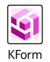

---
hide:
  - navigation
---

---
Choreo is an advanced open-source orchestration framework designed to simplify and enhance how you automate and orchestrate systems. Built on the principles of Kubernetes and leveraging the Kubernetes Resource Model (KRM), it utilizes an event-driven and declarative approach to automation. This versatile platform empowers teams to manage a broad spectrum of systems and processes, including lifecycle management, provisioning, configuration, and application deployment. As a freely available tool, Choreo thrives on the collective expertise and innovation contributed by its vibrant community.

## Key Features of Choreo

Choreo integrates a range of features designed to streamline operations and foster collaboration, making it a versatile tool for any environment:

- Bring Your Own Schema/API: Customization at Your Fingertips: Choreo allows you to integrate your own schemas or APIs, enabling seamless tailoring of the orchestration framework to meet your specific requirements.
- Service Catalog: Ready-to-Deploy Solutions: Access a rich service catalog offering a variety of pre-defined templates and configurations. This feature speeds up deployment and ensures that best practices are easily adopted.
- Modular Business Logic: Build As You Go: The framework supports modular business logic, which facilitates easy extensions and adaptations throughout the lifecycle of your projects.
- Low Code/No Code: Accessibility for Everyone: Choreo’s low-code/no-code capabilities ensure that high levels of automation are achievable without deep coding knowledge, making advanced orchestration accessible to a broader audience.
- Collaborative Change Management: Streamlined Teamwork: With robust tools for collaborative change management, Choreo ensures that teams can work together efficiently. Changes are easy to track, manage, and review, enhancing transparency and reducing the risk of conflicts or errors.

## Revolutionizing Orchestration

Choreo is more than just an orchestration engine—it’s a comprehensive solution that transforms how teams interact with technology. By automating complex processes and enabling effective collaboration, Choreo helps you meet your objectives faster and more reliably than ever before. It stands as an indispensable tool for anyone looking to optimize their operations and systems, and harness the power of automation in a scalable, user-friendly environment.

## Join us

Have questions, ideas, bug reports or just want to chat? Come join [discord server](https://discord.gg/fH35bmcTU9).

